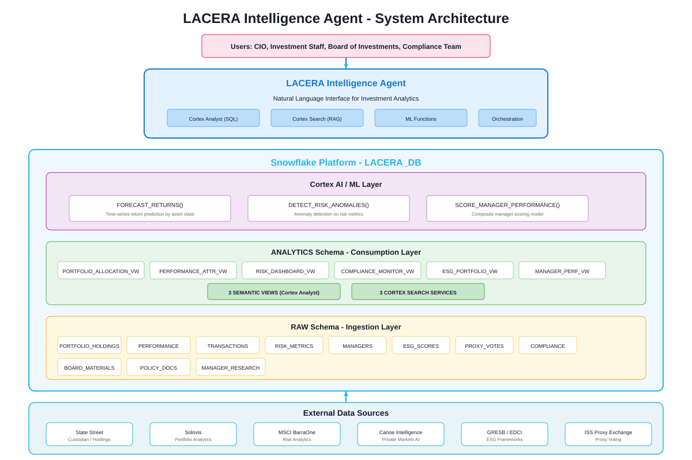
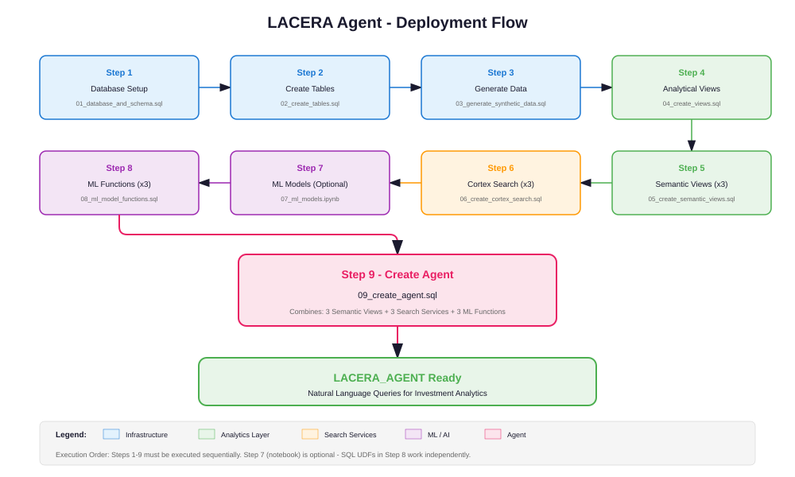
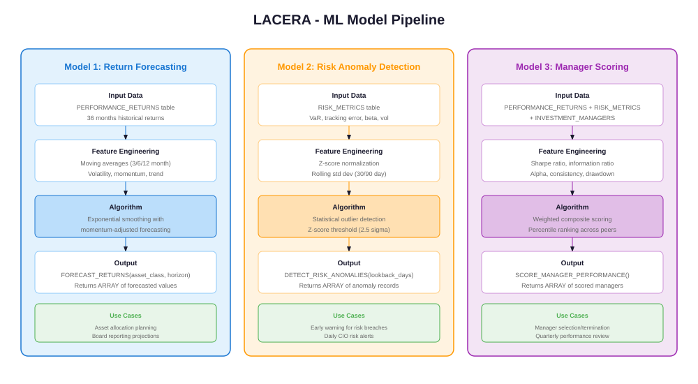

# LACERA Intelligence Agent

## Overview

The LACERA Intelligence Agent is a Snowflake-native AI assistant built for the **Los Angeles County Employees Retirement Association** - one of the largest county retirement systems in the United States, managing approximately **$75 billion** in assets for over 180,000 members.

The agent enables natural language querying across portfolio analytics, risk management, compliance monitoring, ESG reporting, and investment policy documents.

## Architecture



## Capabilities

<table>
<thead>
<tr><th>Capability</th><th>Tool Type</th><th>Description</th></tr>
</thead>
<tbody>
<tr><td>Portfolio Analytics</td><td>Semantic View (Text-to-SQL)</td><td>Holdings, allocations, performance, manager data, transactions</td></tr>
<tr><td>Risk and Compliance</td><td>Semantic View (Text-to-SQL)</td><td>VaR, volatility, Sharpe ratios, compliance events, policy violations</td></tr>
<tr><td>ESG and Governance</td><td>Semantic View (Text-to-SQL)</td><td>ESG scores, carbon intensity, proxy voting, sustainability metrics</td></tr>
<tr><td>Policy Search</td><td>Cortex Search (RAG)</td><td>Investment policy documents, IPS, guidelines</td></tr>
<tr><td>Board Materials Search</td><td>Cortex Search (RAG)</td><td>Board meeting materials, performance reports, strategic reviews</td></tr>
<tr><td>Manager Research Search</td><td>Cortex Search (RAG)</td><td>Due diligence notes, performance assessments, operational reviews</td></tr>
<tr><td>Return Forecasting</td><td>ML Function</td><td>Exponential smoothing with momentum-adjusted forecasting</td></tr>
<tr><td>Risk Anomaly Detection</td><td>ML Function</td><td>Z-score based statistical outlier detection on risk metrics</td></tr>
<tr><td>Manager Scoring</td><td>ML Function</td><td>Multi-factor composite scoring and quartile ranking</td></tr>
</tbody>
</table>

## Deployment Flow



## Quick Start

Execute the SQL files in order:

```bash
# 1. Create database, schemas, warehouse
snowsql -f sql/setup/01_database_and_schema.sql

# 2. Create all tables
snowsql -f sql/setup/02_create_tables.sql

# 3. Load synthetic data
snowsql -f sql/data/03_generate_synthetic_data.sql

# 4. Create analytical views
snowsql -f sql/views/04_create_views.sql

# 5. Create semantic views (3)
snowsql -f sql/views/05_create_semantic_views.sql

# 6. Create Cortex Search services (3)
snowsql -f sql/search/06_create_cortex_search.sql

# 7. (Optional) Review ML notebook
# notebooks/07_ml_models.ipynb

# 8. Create ML prediction functions (3)
snowsql -f sql/models/08_ml_model_functions.sql

# 9. Create the agent
snowsql -f sql/agent/09_create_agent.sql
```

## Project Structure

```
/
├── README.md
├── docs/
│   ├── AGENT_SETUP.md
│   ├── DEPLOYMENT_SUMMARY.md
│   ├── questions.md
│   └── images/
│       ├── architecture.svg
│       ├── deployment_flow.svg
│       ├── ml_models.svg
│       └── Snowflake_Logo.svg
├── notebooks/
│   └── 07_ml_models.ipynb
└── sql/
    ├── setup/
    │   ├── 01_database_and_schema.sql
    │   └── 02_create_tables.sql
    ├── data/
    │   └── 03_generate_synthetic_data.sql
    ├── views/
    │   ├── 04_create_views.sql
    │   └── 05_create_semantic_views.sql
    ├── search/
    │   └── 06_create_cortex_search.sql
    ├── models/
    │   └── 08_ml_model_functions.sql
    └── agent/
        └── 09_create_agent.sql
```

## Data Model

<table>
<thead>
<tr><th>Table</th><th>Schema</th><th>Description</th><th>Records (approx)</th></tr>
</thead>
<tbody>
<tr><td>ASSET_CLASSES</td><td>RAW</td><td>8 asset class definitions with targets and benchmarks</td><td>8</td></tr>
<tr><td>INVESTMENT_MANAGERS</td><td>RAW</td><td>52 external investment managers across all asset classes</td><td>52</td></tr>
<tr><td>PORTFOLIO_HOLDINGS</td><td>RAW</td><td>Monthly holdings by manager (36 months x 49 managers)</td><td>~1,764</td></tr>
<tr><td>PERFORMANCE_RETURNS</td><td>RAW</td><td>Monthly returns with benchmark comparisons</td><td>~1,764</td></tr>
<tr><td>TRANSACTIONS</td><td>RAW</td><td>Buy/sell/rebalance activity over 3 years</td><td>~1,500</td></tr>
<tr><td>BENCHMARKS</td><td>RAW</td><td>Monthly benchmark index returns</td><td>~288</td></tr>
<tr><td>RISK_METRICS</td><td>RAW</td><td>VaR, Sharpe, volatility, tracking error by manager</td><td>~1,764</td></tr>
<tr><td>COMPLIANCE_EVENTS</td><td>RAW</td><td>Policy violations and mandate breaches</td><td>30</td></tr>
<tr><td>ESG_SCORES</td><td>RAW</td><td>Quarterly ESG ratings (MSCI, GRESB, EDCI)</td><td>~1,200</td></tr>
<tr><td>PROXY_VOTES</td><td>RAW</td><td>Shareholder proxy voting records</td><td>20</td></tr>
<tr><td>BOARD_MATERIALS</td><td>RAW</td><td>Board meeting report documents (text)</td><td>10</td></tr>
<tr><td>POLICY_DOCUMENTS</td><td>RAW</td><td>Investment policies and guidelines (text)</td><td>8</td></tr>
<tr><td>MANAGER_RESEARCH</td><td>RAW</td><td>Due diligence and research notes (text)</td><td>8</td></tr>
</tbody>
</table>

## ML Models



## Requirements

- Snowflake account with Cortex AI features enabled
- Role with CREATE DATABASE, CREATE WAREHOUSE, CREATE AGENT privileges
- SNOWFLAKE.CORTEX_USER database role (for Cortex Search)
